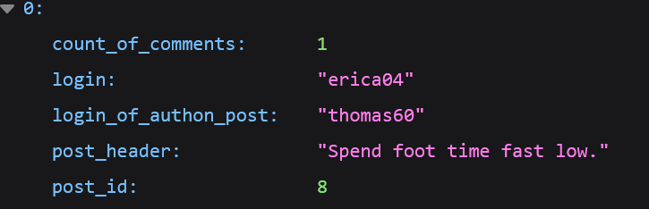
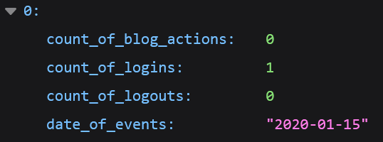

# python_dev_Fisun_Semyon
Практика в Farpost 2025


Generate fake dat

```shell
python3 -m venv .venv
.venv\Scripts\activate
pip install -r requirements.txt
flask --app flaskr/app.py init-db

```


Then run webserver

```shell
flask --app flaskr/app.py  run --debug
```


Then goto your browser and test, for example:

http://127.0.0.1:5000/api/comments?login=erica04

http://127.0.0.1:5000/api/general?login=erica04


*картинки первых ответов для наглядности

Discription:
Из добавленного, не прописанного в ТЗ, я добавил таблицу комментариев в authors.sql. 
Я сделал это потому что надо выводить куда юзер писал комментарий, а из требований задания это сделать было невозможно.

Схемы БД в /flaskr/schema

Сами БД в /instance

Файл программы /flaskr/app.py
